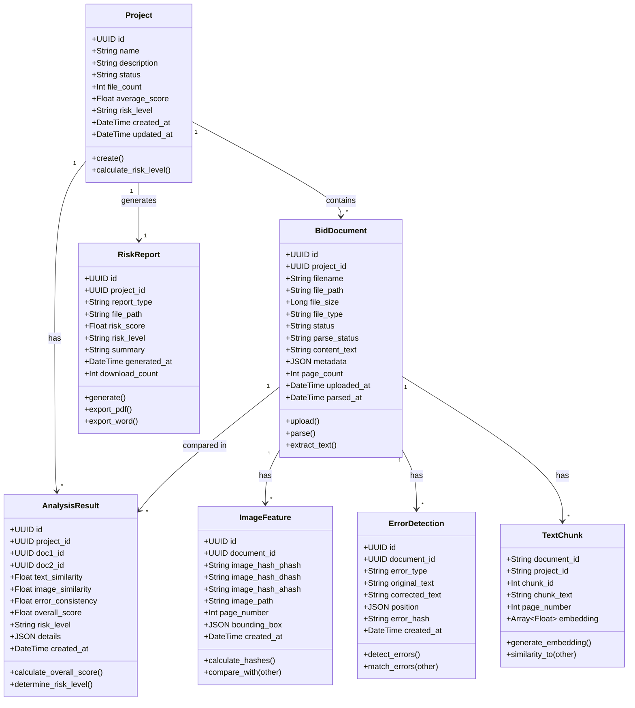
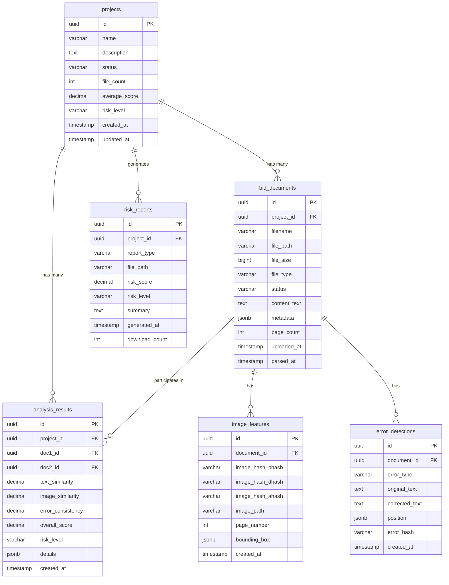
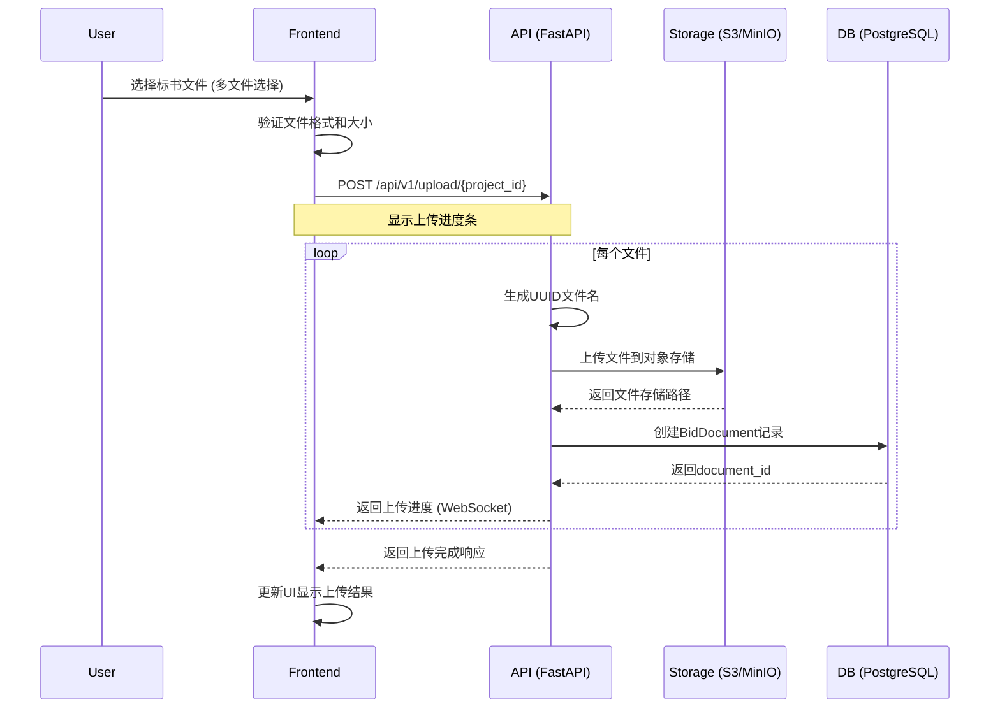
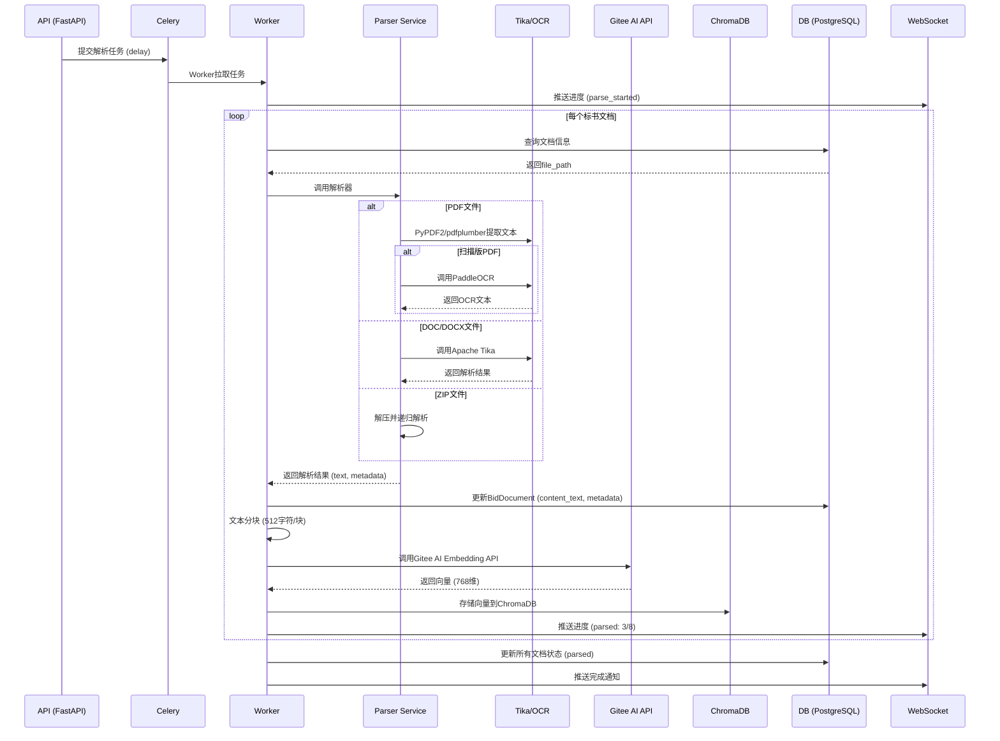
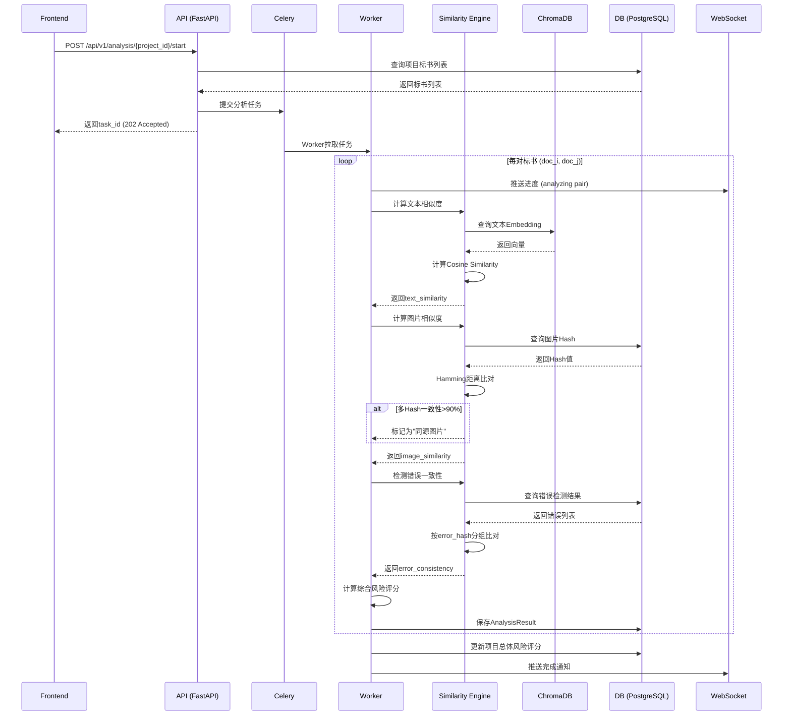
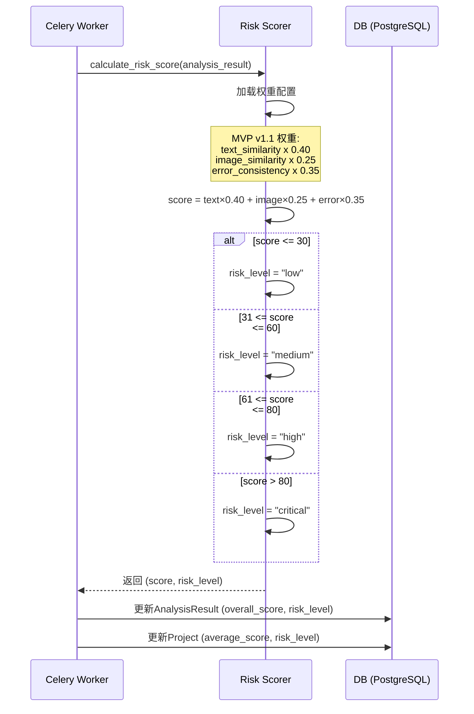
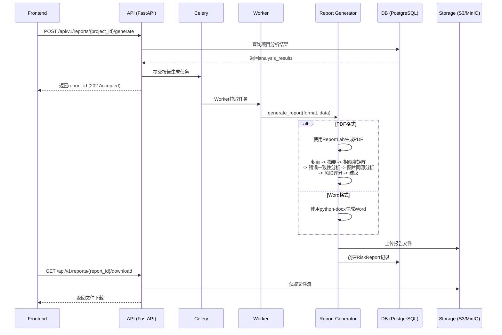
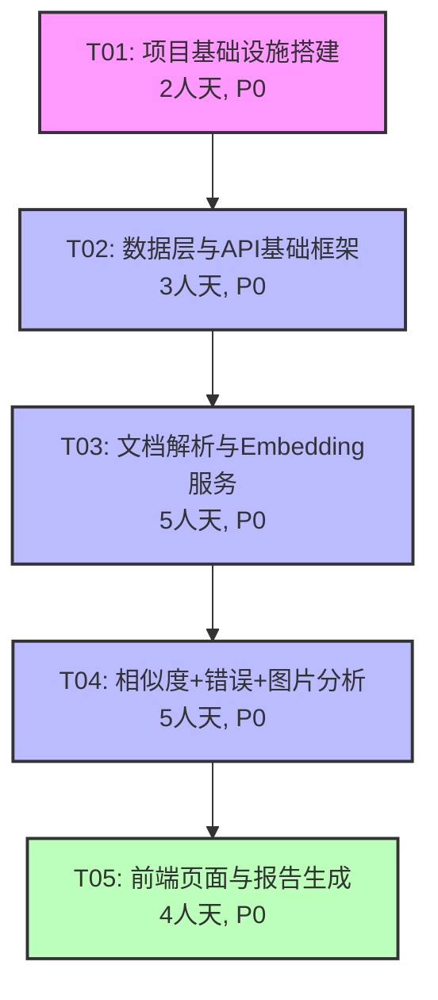

# 投标标书智能分析监督系统（BASS-MVP）架构设计文档

**版本**: v1.1  
**日期**: 2024-02-21  
**架构师**: Bob (Software Architect)  
**项目代号**: BASS-MVP  
**状态**: ✅ 已同步PRD v1.1

---

## 目录

1. [实现方案与框架选型](#1-实现方案与框架选型)
2. [文件列表及目录结构](#2-文件列表及目录结构)
3. [数据结构和接口设计](#3-数据结构和接口设计)
4. [程序调用流程](#4-程序调用流程)
5. [任务分解列表](#5-任务分解列表)
6. [依赖包列表](#6-依赖包列表)
7. [共享知识和规范](#7-共享知识和规范)
8. [待明确事项](#8-待明确事项)

---

## 1. 实现方案与框架选型

### 1.1 技术难点分析

#### 核心挑战

| 挑战点 | 技术难点 | 解决方案 |
|--------|----------|----------|
| **多格式文档解析** | PDF/DOC/DOCX/ZIP格式差异大，解析库不统一 | Apache Tika统一解析接口 + 格式特定解析器 |
| **扫描版PDF识别** | OCR准确率要求>85%，中文识别难度大 | PaddleOCR 3.0+ (中文优化，准确率>90%) |
| **大规模相似度计算** | 多标书全文比对计算量大 | Gitee AI Embedding API向量化 + ChromaDB向量检索 |
| **向量化存储检索** | 高维向量存储、索引构建、快速检索 | ChromaDB（内置服务，嵌入Python进程） |
| **并发处理能力** | 多文件上传、解析、分析并发处理 | Celery异步任务队列 + Redis消息队列 |
| **错误一致性检测** | 跨标书识别相同错别字、语病、漏字 | jieba分词 + 中文拼写检查 + 文本比对Diff算法 |
| **图片同源检测** | 识别不同标书中的相同图片 | pHash/dHash/aHash多Hash融合判断 |

#### 技术变更说明（PRD v1.0 → v1.1）

| 变更项 | 旧方案 | 新方案 | 原因 |
|--------|--------|--------|------|
| Embedding模型 | 本地sentence-transformers | Gitee AI Embedding API (Qwen3-Embedding-8B) | 无需本地GPU，调用云端API |
| 向量数据库 | Milvus 2.3+（独立部署） | ChromaDB（内置服务） | MVP阶段<10万条向量，简化部署 |
| OFD格式支持 | 支持OFD解析 | ❌ 移除 | 用户确认不需要 |
| 错误一致性分析 | P1（暂缓） | ✅ 提升至P0 | 用户确认为核心功能 |
| 图片相似分析 | P2（可延后） | ✅ 提升至P0 | 用户确认为核心功能 |
| 模板复用分析 | P0 | ❌ 推迟到后续版本 | 用户确认 |
| 表格相似分析 | P1 | ❌ 推迟到后续版本 | 用户确认 |
| 文件元数据分析 | P1 | ❌ 推迟到后续版本 | 用户确认 |
| 标书对比页 | P2 | ❌ 推迟到后续版本 | 用户确认 |
| 首页Dashboard | P2 | ❌ 推迟到后续版本 | 用户确认 |

### 1.2 前端技术栈详细选型

```yaml
核心框架:
  - React: 18.2.0 (Hooks, Concurrent Mode)
  - TypeScript: 5.2.0 (类型安全)
  - Vite: 5.0.0 (快速构建)

UI组件库:
  - Ant Design: 5.12.0 (企业级UI)
  - @ant-design/icons: 5.2.0 (图标库)
  - antd-pro-components: 2.6.0 (高级组件)

路由与状态:
  - React Router DOM: 6.20.0 (路由管理)
  - Zustand: 4.4.0 (轻量级状态管理)
  - immer: 10.0.0 (不可变数据)

数据请求:
  - Axios: 1.6.0 (HTTP客户端)
  - SWR: 2.2.0 (数据缓存与同步)
  - WebSocket: 原生 (实时进度推送)

图表与预览:
  - ECharts: 5.4.0 (相似度矩阵可视化)
  - React ECharts: 2.0.0 (ECharts React封装)
  - PDF.js: 3.11.0 (PDF在线预览)
  - Mammoth: 1.5.0 (DOCX在线预览)

构建与质量:
  - ESLint: 8.55.0 (代码规范)
  - Prettier: 3.1.0 (代码格式化)
  - Vitest: 1.0.0 (单元测试)
```

### 1.3 后端技术栈详细选型

```yaml
核心框架:
  - Python: 3.10+ (稳定版本)
  - FastAPI: 0.109.0 (高性能异步API)
  - Uvicorn: 0.27.0 (ASGI服务器)

数据库:
  - PostgreSQL: 16.0 (关系型数据库)
  - SQLAlchemy: 2.0.0 (ORM)
  - Alembic: 1.13.0 (数据库迁移)
  - ChromaDB: 0.4.22 (向量数据库，嵌入Python进程)

异步任务:
  - Celery: 5.3.0 (分布式任务队列)
  - Redis: 7.2.0 (消息队列 + 缓存)
  - Flower: 2.0.0 (Celery监控)

文档解析:
  - Apache Tika: 2.9.0 (统一文档解析)
  - PyPDF2: 3.0.0 (PDF解析)
  - python-docx: 1.1.0 (DOCX解析)
  - pdfplumber: 0.10.0 (PDF表格提取)
  - PaddleOCR: 3.0.0 (OCR识别)

文本分析:
  - httpx: 0.26.0 (异步HTTP客户端，调用Gitee AI API)
  - scikit-learn: 1.3.0 (余弦相似度计算)
  - jieba: 0.42.0 (中文分词)
  - difflib: 内置 (文本差异比对)
  - pypinyin: 0.50.0 (拼音转换)

错误检测:
  - pycorrector: 1.0.0 (中文错别字检测)
  - hanzi_compare: 内置算法 (汉字相似度比对)

图片分析:
  - Pillow: 10.1.0 (图像处理)
  - imagehash: 4.3.0 (图片Hash计算: pHash/dHash/aHash)
  - OpenCV: 4.9.0 (计算机视觉)

文件处理:
  - aiofiles: 23.2.0 (异步文件操作)
  - python-multipart: 0.0.6 (文件上传)
  - zipfile: 内置 (ZIP解压)

API文档与验证:
  - Pydantic: 2.5.0 (数据验证)

日志与监控:
  - loguru: 0.7.0 (日志管理)
  - sentry-sdk: 1.38.0 (错误追踪)
```

### 1.4 数据库设计

#### 关系型数据库 (PostgreSQL)

```sql
-- 项目表
CREATE TABLE projects (
    id UUID PRIMARY KEY DEFAULT gen_random_uuid(),
    name VARCHAR(255) NOT NULL,
    description TEXT,
    status VARCHAR(50) DEFAULT 'active',
    file_count INT DEFAULT 0,
    risk_level VARCHAR(20),
    average_score DECIMAL(5,2),
    created_at TIMESTAMP DEFAULT CURRENT_TIMESTAMP,
    updated_at TIMESTAMP DEFAULT CURRENT_TIMESTAMP,
    created_by UUID
);

-- 标书文档表
CREATE TABLE bid_documents (
    id UUID PRIMARY KEY DEFAULT gen_random_uuid(),
    project_id UUID REFERENCES projects(id) ON DELETE CASCADE,
    filename VARCHAR(255) NOT NULL,
    file_path VARCHAR(500) NOT NULL,
    file_size BIGINT,
    file_type VARCHAR(50),
    status VARCHAR(50) DEFAULT 'uploaded',
    parse_status VARCHAR(50),
    content_text TEXT,
    metadata JSONB,
    page_count INT,
    uploaded_at TIMESTAMP DEFAULT CURRENT_TIMESTAMP,
    parsed_at TIMESTAMP
);

-- 分析结果表
CREATE TABLE analysis_results (
    id UUID PRIMARY KEY DEFAULT gen_random_uuid(),
    project_id UUID REFERENCES projects(id) ON DELETE CASCADE,
    doc1_id UUID REFERENCES bid_documents(id),
    doc2_id UUID REFERENCES bid_documents(id),
    text_similarity DECIMAL(5,2),
    structure_similarity DECIMAL(5,2),
    image_similarity DECIMAL(5,2),
    table_similarity DECIMAL(5,2),
    error_consistency DECIMAL(5,2),
    metadata_consistency DECIMAL(5,2),
    overall_score DECIMAL(5,2),
    risk_level VARCHAR(20),
    details JSONB,
    created_at TIMESTAMP DEFAULT CURRENT_TIMESTAMP
);

-- 风险报告表
CREATE TABLE risk_reports (
    id UUID PRIMARY KEY DEFAULT gen_random_uuid(),
    project_id UUID REFERENCES projects(id) ON DELETE CASCADE,
    report_type VARCHAR(50) DEFAULT 'pdf',
    file_path VARCHAR(500),
    risk_score DECIMAL(5,2),
    risk_level VARCHAR(20),
    summary TEXT,
    generated_at TIMESTAMP DEFAULT CURRENT_TIMESTAMP,
    download_count INT DEFAULT 0
);

-- 图片特征表
CREATE TABLE image_features (
    id UUID PRIMARY KEY DEFAULT gen_random_uuid(),
    document_id UUID REFERENCES bid_documents(id) ON DELETE CASCADE,
    image_hash VARCHAR(255),
    image_path VARCHAR(500),
    page_number INT,
    bounding_box JSONB,
    created_at TIMESTAMP DEFAULT CURRENT_TIMESTAMP
);

-- 错误检测记录表
CREATE TABLE error_detections (
    id UUID PRIMARY KEY DEFAULT gen_random_uuid(),
    document_id UUID REFERENCES bid_documents(id) ON DELETE CASCADE,
    error_type VARCHAR(50),  -- typo, grammar, omission, format
    original_text TEXT,
    corrected_text TEXT,
    position JSONB,
    error_hash VARCHAR(255),
    created_at TIMESTAMP DEFAULT CURRENT_TIMESTAMP
);

-- 任务状态表
CREATE TABLE celery_taskmeta (
    id SERIAL PRIMARY KEY,
    task_id VARCHAR(255) UNIQUE,
    status VARCHAR(50),
    result TEXT,
    date_done TIMESTAMP,
    traceback TEXT
);

-- 索引
CREATE INDEX idx_bid_documents_project_id ON bid_documents(project_id);
CREATE INDEX idx_analysis_results_doc1_id ON analysis_results(doc1_id);
CREATE INDEX idx_analysis_results_doc2_id ON analysis_results(doc2_id);
CREATE INDEX idx_image_features_document_id ON image_features(document_id);
CREATE INDEX idx_error_detections_document_id ON error_detections(document_id);
CREATE INDEX idx_image_features_hash ON image_features(image_hash);
CREATE INDEX idx_error_detections_hash ON error_detections(error_hash);
```

#### 向量数据库 (ChromaDB)

ChromaDB作为内置向量数据库，嵌入Python进程中，无需独立部署。

```python
# ChromaDB 配置
import chromadb

# 创建客户端（持久化模式，数据存储在本地磁盘）
chroma_client = chromadb.PersistentClient(path="./data/chromadb/")

# 文本Embedding集合
text_collection = chroma_client.get_or_create_collection(
    name="text_embeddings",
    metadata={"hnsw:space": "cosine"},  # 使用余弦相似度
)

# 文档结构
# text_collection 每条记录:
#   id: f"{document_id}_{chunk_id}"
#   embedding: Array[float]  (由Gitee AI API生成，768维)
#   metadata: {
#       "document_id": str,
#       "project_id": str,
#       "chunk_text": str,
#       "page_number": int,
#       "paragraph_id": int
#   }

# 相似度搜索
results = text_collection.query(
    query_embeddings=[embedding],
    n_results=10,
    where={"project_id": project_id},
    include=["metadatas", "distances"]
)
```

### 1.5 部署架构

#### 开发环境

```yaml
前端:
  - 本地开发服务器: Vite Dev Server (http://localhost:5173)
  - API代理: Vite Proxy -> Backend (http://localhost:8000)

后端:
  - 本地开发服务器: Uvicorn (http://localhost:8000)
  - 热重载: --reload 参数
  - PostgreSQL: Docker容器 (localhost:5432)
  - Redis: Docker容器 (localhost:6379)

异步任务:
  - Celery Worker: 本地启动
  - Flower监控: http://localhost:5555

向量数据库:
  - ChromaDB: 嵌入Python进程，数据存储在 ./data/chromadb/
  - 无需独立部署
```

#### 测试环境

```yaml
前端:
  - 构建产物: dist/ 目录
  - Web服务器: Nginx (http://test.example.com)

后端:
  - 应用服务器: Gunicorn + Uvicorn Workers
  - API网关: Nginx反向代理
  - 数据库: PostgreSQL (独立服务器)
  - 缓存/队列: Redis (独立服务器)
  - 向量数据库: ChromaDB (随应用进程启动)

监控:
  - Prometheus + Grafana
  - Sentry错误追踪
```

#### 生产环境

```yaml
前端:
  - CDN: 静态资源加速
  - Web服务器: Nginx集群 (负载均衡)
  - HTTPS: Let's Encrypt证书

后端:
  - 应用服务器: Docker容器 + Kubernetes编排
  - API网关: Kong / AWS API Gateway
  - 负载均衡: Nginx / AWS ALB
  - 数据库: PostgreSQL主从复制 + 读写分离
  - 缓存: Redis Cluster
  - 向量数据库: ChromaDB (随应用容器启动，持久化到PVC)
  - 对象存储: AWS S3 / MinIO (标书文件存储)

异步任务:
  - Celery Worker: 动态扩展
  - 任务监控: Flower + Prometheus

日志与监控:
  - ELK Stack (Elasticsearch + Logstash + Kibana)
  - Prometheus + Grafana
  - Sentry
```

### 1.6 架构模式

```
┌─────────────────────────────────────────────────────────────┐
│                        前端层 (React)                        │
│  ┌──────────┐  ┌──────────┐  ┌──────────┐                 │
│  │ Analysis │  │ Compare  │  │  Report  │                 │
│  └──────────┘  └──────────┘  └──────────┘                 │
└─────────────────────┬───────────────────────────────────────┘
                      │ HTTP/WebSocket
┌─────────────────────▼───────────────────────────────────────┐
│                     API网关层 (FastAPI)                      │
│  ┌──────────┐  ┌──────────┐  ┌──────────┐  ┌──────────┐  │
│  │  Upload  │  │  Analyze │  │  Report  │  │  Query   │  │
│  └──────────┘  └──────────┘  └──────────┘  └──────────┘  │
└─────────────────────┬───────────────────────────────────────┘
                      │
┌─────────────────────▼───────────────────────────────────────┐
│                   业务逻辑层 (Services)                       │
│  ┌──────────┐  ┌──────────┐  ┌──────────┐  ┌──────────┐  │
│  │  Parser  │  │ Analyzer │  │  Scorer  │  │ Generator│  │
│  │          │  │ + Error  │  │          │  │          │  │
│  │          │  │ + Image  │  │          │  │          │  │
│  └──────────┘  └──────────┘  └──────────┘  └──────────┘  │
└─────────────────────┬───────────────────────────────────────┘
                      │
┌─────────────────────▼───────────────────────────────────────┐
│                    数据访问层 (DAO)                          │
│  ┌──────────┐  ┌──────────┐  ┌──────────┐  ┌──────────┐  │
│  │  SQL     │  │ ChromaDB │  │  Cache   │  │  File    │  │
│  │  Alchemy │  │ (内置)   │  │  Redis   │  │  System  │  │
│  └──────────┘  └──────────┘  └──────────┘  └──────────┘  │
└─────────────────────┬───────────────────────────────────────┘
                      │
┌─────────────────────▼───────────────────────────────────────┐
│                      数据持久层                              │
│  ┌──────────┐  ┌──────────┐  ┌──────────┐  ┌──────────┐  │
│  │PostgreSQL│  │ ChromaDB │  │  Redis   │  │   S3/    │  │
│  │          │  │(本地磁盘) │  │          │  │  MinIO   │  │
│  └──────────┘  └──────────┘  └──────────┘  └──────────┘  │
└─────────────────────────────────────────────────────────────┘
```

---

## 2. 文件列表及目录结构

### 2.1 前端文件结构

```
frontend/
├── public/
│   ├── favicon.ico
│   ├── logo192.png
│   ├── logo512.png
│   └── manifest.json
├── src/
│   ├── assets/
│   │   ├── styles/
│   │   │   ├── global.css
│   │   │   ├── variables.css
│   │   │   └── antd-custom.less
│   │   ├── images/
│   │   │   ├── logo.svg
│   │   │   ├── empty.svg
│   │   │   └── icons/
│   │   └── fonts/
│   ├── components/
│   │   ├── common/
│   │   │   ├── PageHeader.tsx
│   │   │   ├── LoadingSpinner.tsx
│   │   │   ├── ErrorBoundary.tsx
│   │   │   ├── EmptyState.tsx
│   │   │   └── ConfirmModal.tsx
│   │   ├── upload/
│   │   │   ├── FileUpload.tsx
│   │   │   ├── FileList.tsx
│   │   │   ├── UploadProgress.tsx
│   │   │   └── DraggerUpload.tsx
│   │   ├── analysis/
│   │   │   ├── SimilarityMatrix.tsx
│   │   │   ├── RiskScoreChart.tsx
│   │   │   ├── AnalysisProgress.tsx
│   │   │   ├── ErrorConsistencyCard.tsx
│   │   │   └── ImageSimilarityCard.tsx
│   │   ├── report/
│   │   │   ├── ReportPreview.tsx
│   │   │   ├── ReportDownload.tsx
│   │   │   └── ReportSummary.tsx
│   │   └── layout/
│   │       ├── AppLayout.tsx
│   │       ├── Sidebar.tsx
│   │       ├── Header.tsx
│   │       └── Breadcrumb.tsx
│   ├── pages/
│   │   ├── ProjectAnalysis/
│   │   │   ├── index.tsx
│   │   │   ├── components/
│   │   │   │   ├── CompanyList.tsx
│   │   │   │   ├── SimilarityHeatmap.tsx
│   │   │   │   └── AnalysisConfig.tsx
│   │   │   └── styles.module.css
│   │   ├── ReportView/
│   │   │   ├── index.tsx
│   │   │   ├── components/
│   │   │   │   ├── PDFPreview.tsx
│   │   │   │   ├── WordPreview.tsx
│   │   │   │   └── DownloadButton.tsx
│   │   │   └── styles.module.css
│   │   └── NotFound/
│   │       └── index.tsx
│   ├── services/
│   │   ├── api.ts
│   │   ├── uploadService.ts
│   │   ├── analysisService.ts
│   │   ├── reportService.ts
│   │   ├── websocketService.ts
│   │   └── types.ts
│   ├── store/
│   │   ├── index.ts
│   │   ├── projectStore.ts
│   │   ├── documentStore.ts
│   │   ├── analysisStore.ts
│   │   └── uiStore.ts
│   ├── hooks/
│   │   ├── useProject.ts
│   │   ├── useDocument.ts
│   │   ├── useAnalysis.ts
│   │   ├── useWebSocket.ts
│   │   └── usePagination.ts
│   ├── utils/
│   │   ├── constants.ts
│   │   ├── helpers.ts
│   │   ├── validators.ts
│   │   ├── formatters.ts
│   │   └── download.ts
│   ├── types/
│   │   ├── project.d.ts
│   │   ├── document.d.ts
│   │   ├── analysis.d.ts
│   │   └── api.d.ts
│   ├── App.tsx
│   ├── main.tsx
│   └── vite-env.d.ts
├── index.html
├── package.json
├── tsconfig.json
├── tsconfig.node.json
├── vite.config.ts
├── .eslintrc.cjs
├── .prettierrc
├── .env.development
├── .env.production
└── README.md
```

### 2.2 后端文件结构

```
backend/
├── app/
│   ├── __init__.py
│   ├── main.py
│   ├── config.py
│   ├── dependencies.py
│   ├── api/
│   │   ├── __init__.py
│   │   ├── v1/
│   │   │   ├── __init__.py
│   │   │   ├── endpoints/
│   │   │   │   ├── __init__.py
│   │   │   │   ├── upload.py
│   │   │   │   ├── projects.py
│   │   │   │   ├── documents.py
│   │   │   │   ├── analysis.py
│   │   │   │   ├── reports.py
│   │   │   │   └── health.py
│   │   │   └── api.py
│   │   └── deps.py
│   ├── core/
│   │   ├── __init__.py
│   │   ├── config.py
│   │   ├── logging.py
│   │   └── middleware.py
│   ├── models/
│   │   ├── __init__.py
│   │   ├── project.py
│   │   ├── document.py
│   │   ├── analysis.py
│   │   ├── report.py
│   │   ├── image_feature.py
│   │   ├── error_detection.py
│   │   └── base.py
│   ├── schemas/
│   │   ├── __init__.py
│   │   ├── project.py
│   │   ├── document.py
│   │   ├── analysis.py
│   │   ├── report.py
│   │   ├── error.py
│   │   └── response.py
│   ├── services/
│   │   ├── __init__.py
│   │   ├── parser/
│   │   │   ├── __init__.py
│   │   │   ├── base_parser.py
│   │   │   ├── pdf_parser.py
│   │   │   ├── docx_parser.py
│   │   │   ├── doc_parser.py
│   │   │   ├── zip_handler.py
│   │   │   ├── ocr_engine.py
│   │   │   └── tika_client.py
│   │   ├── analyzer/
│   │   │   ├── __init__.py
│   │   │   ├── text_analyzer.py
│   │   │   ├── image_analyzer.py
│   │   │   └── error_analyzer.py
│   │   ├── embedding/
│   │   │   ├── __init__.py
│   │   │   ├── gitee_embedding.py
│   │   │   ├── vector_store.py
│   │   │   └── similarity_calculator.py
│   │   ├── scoring/
│   │   │   ├── __init__.py
│   │   │   ├── risk_scorer.py
│   │   │   ├── weight_config.py
│   │   │   └── threshold.py
│   │   └── report/
│   │       ├── __init__.py
│   │       ├── pdf_generator.py
│   │       ├── word_generator.py
│   │       └── template_engine.py
│   ├── tasks/
│   │   ├── __init__.py
│   │   ├── celery_app.py
│   │   ├── parse_tasks.py
│   │   ├── analysis_tasks.py
│   │   └── report_tasks.py
│   ├── db/
│   │   ├── __init__.py
│   │   ├── session.py
│   │   ├── base.py
│   │   ├── init_db.py
│   │   └── migrations/
│   ├── vector_db/
│   │   ├── __init__.py
│   │   ├── chromadb_client.py
│   │   └── collection_manager.py
│   ├── utils/
│   │   ├── __init__.py
│   │   ├── file_utils.py
│   │   ├── text_utils.py
│   │   ├── hash_utils.py
│   │   ├── time_utils.py
│   │   └── validators.py
│   └── websocket/
│       ├── __init__.py
│       ├── manager.py
│       └── events.py
├── tests/
│   ├── __init__.py
│   ├── conftest.py
│   ├── test_api/
│   ├── test_services/
│   ├── test_tasks/
│   └── fixtures/
├── scripts/
│   ├── init_db.py
│   ├── init_chromadb.py
│   ├── seed_data.py
│   └── backup_db.py
├── docker/
│   ├── Dockerfile
│   ├── docker-compose.yml
│   ├── docker-compose.dev.yml
│   └── entrypoint.sh
├── data/
│   └── chromadb/          # ChromaDB持久化数据目录
├── requirements.txt
├── requirements-dev.txt
├── alembic.ini
├── alembic/
│   ├── env.py
│   ├── script.py.mako
│   └── versions/
├── .env.example
├── .env.development
├── .env.production
├── .gitignore
├── .flake8
├── pyproject.toml
└── README.md
```

### 2.3 配置文件

```
config/
├── frontend/
│   ├── .env.development
│   ├── .env.production
│   └── vite.config.ts
├── backend/
│   ├── config.yaml
│   ├── logging.yaml
│   └── celery.yaml
├── database/
│   ├── postgresql.conf
│   └── init.sql
├── chromadb/
│   └── chroma_config.yaml
└── nginx/
    ├── nginx.conf
    └── ssl/
```

### 2.4 文档文件

```
docs/
├── PRD.md
├── architecture-design.md
├── api-documentation.md
├── deployment-guide.md
├── user-manual.md
└── developer-guide.md
```

---

## 3. 数据结构和接口设计

### 3.1 核心数据模型 (Mermaid Class Diagram)



### 3.2 数据库ER图 (Mermaid ER Diagram)



### 3.3 RESTful API接口设计

#### 3.3.1 标书上传接口

```yaml
POST /api/v1/upload/{project_id}
Description: 上传标书文件到指定项目
Content-Type: multipart/form-data
Request:
  - project_id: UUID (path parameter)
  - files: File[] (form-data, 支持多文件)
  - overwrite: Boolean (optional, default=false)

Response:
  200 OK:
    {
      "code": 0,
      "message": "success",
      "data": {
        "uploaded_files": [
          {
            "id": "uuid",
            "filename": "标书1.pdf",
            "file_size": 5242880,
            "status": "uploaded"
          }
        ],
        "failed_files": []
      }
    }

Supported Formats: PDF, DOC, DOCX, ZIP
File Size Limit: 50MB per file
```

#### 3.3.2 项目分析接口

```yaml
POST /api/v1/analysis/{project_id}/start
Description: 启动项目标书分析任务
Request:
  {
    "analysis_config": {
      "text_similarity": true,
      "image_analysis": true,
      "error_detection": true
    },
    "similarity_threshold": 0.80,
    "dimensions": ["text", "image", "error"]
  }

Response:
  202 Accepted:
    {
      "code": 0,
      "message": "Analysis task created",
      "data": {
        "task_id": "celery-task-uuid",
        "status": "pending",
        "dimensions": ["text", "image", "error"]
      }
    }

GET /api/v1/analysis/{project_id}/status
Description: 查询项目分析进度
Response:
  200 OK:
    {
      "code": 0,
      "data": {
        "task_id": "celery-task-uuid",
        "status": "processing",
        "progress": 65,
        "current_step": "Analyzing error consistency",
        "results": {
          "documents_parsed": 8,
          "total_documents": 8,
          "pairs_analyzed": 14,
          "total_pairs": 28
        }
      }
    }
```

#### 3.3.3 相似度矩阵接口

```yaml
GET /api/v1/analysis/{project_id}/similarity-matrix
Description: 获取标书相似度矩阵
Query Parameters:
  - dimension: String (text|image|error|overall)
  - min_score: Float

Response:
  200 OK:
    {
      "code": 0,
      "data": {
        "documents": [
          {"id": "uuid1", "name": "标书A.pdf"},
          {"id": "uuid2", "name": "标书B.pdf"}
        ],
        "matrix": [
          [1.00, 0.85, 0.92],
          [0.85, 1.00, 0.78],
          [0.92, 0.78, 1.00]
        ],
        "dimension": "text",
        "threshold": 0.80
      }
    }
```

#### 3.3.4 错误一致性检测接口

```yaml
GET /api/v1/analysis/{project_id}/errors
Description: 获取项目所有标书的错误检测结果
Query Parameters:
  - error_type: String (typo|grammar|omission|format)
  - doc_id: UUID (optional, 过滤特定标书)
  - threshold: Float (错误匹配阈值)

Response:
  200 OK:
    {
      "code": 0,
      "data": {
        "common_errors": [
          {
            "error_type": "typo",
            "original_text": "投标",
            "corrected_text": "投标",
            "match_count": 3,
            "documents": [
              {"doc_id": "uuid1", "page": 5},
              {"doc_id": "uuid2", "page": 3},
              {"doc_id": "uuid3", "page": 7}
            ],
            "error_hash": "sha256-xxx"
          }
        ],
        "statistics": {
          "total_errors": 45,
          "common_errors": 12,
          "error_types": {
            "typo": 20,
            "grammar": 10,
            "omission": 8,
            "format": 7
          }
        }
      }
    }
```

#### 3.3.5 图片同源检测接口

```yaml
GET /api/v1/analysis/{project_id}/images
Description: 获取项目所有标书的图片同源检测结果
Query Parameters:
  - threshold: Float (Hash相似度阈值, 默认0.90)
  - page: Int (分页页码)

Response:
  200 OK:
    {
      "code": 0,
      "data": {
        "matched_images": [
          {
            "hash_type": "phash",
            "similarity": 0.95,
            "documents": [
              {"doc_id": "uuid1", "image_path": "images/img1.png", "page": 10},
              {"doc_id": "uuid2", "image_path": "images/img1.png", "page": 8}
            ],
            "conclusion": "same_source"
          }
        ],
        "statistics": {
          "total_images": 120,
          "matched_pairs": 15,
          "same_source_images": 8
        }
      }
    }
```

#### 3.3.6 风险报告生成接口

```yaml
POST /api/v1/reports/{project_id}/generate
Description: 生成风险分析报告
Request:
  {
    "report_format": "pdf",
    "include_sections": [
      "summary",
      "similarity_analysis",
      "image_analysis",
      "error_analysis",
      "risk_score",
      "recommendations"
    ],
    "language": "zh-CN"
  }

Response:
  202 Accepted:
    {
      "code": 0,
      "message": "Report generation started",
      "data": {
        "report_id": "uuid",
        "status": "generating"
      }
    }

GET /api/v1/reports/{report_id}/download
Response: Binary file stream (PDF/Word)
```

#### 3.3.7 WebSocket实时进度推送

```yaml
WebSocket Endpoint: /ws/analysis/{project_id}

Server -> Client (Progress Update):
  {
    "event": "progress",
    "task_id": "celery-task-uuid",
    "progress": 65,
    "current_step": "Analyzing image similarity",
    "details": {
      "documents_parsed": 8,
      "pairs_completed": 14,
      "total_pairs": 28
    }
  }

Server -> Client (Completion):
  {
    "event": "complete",
    "task_id": "celery-task-uuid",
    "result": {
      "status": "success",
      "overall_risk_score": 72.5,
      "risk_level": "high",
      "report_id": "uuid"
    }
  }
```

### 3.4 Pydantic Schemas

```python
# schemas/analysis.py
from pydantic import BaseModel, Field
from typing import List, Optional
from datetime import datetime
from uuid import UUID

class AnalysisConfig(BaseModel):
    text_similarity: bool = True
    image_analysis: bool = True
    error_detection: bool = True

class AnalysisStartRequest(BaseModel):
    analysis_config: AnalysisConfig
    similarity_threshold: float = Field(0.80, ge=0.0, le=1.0)
    dimensions: List[str] = ["text", "image", "error"]

# schemas/error.py
class ErrorDetectionResult(BaseModel):
    id: UUID
    document_id: UUID
    error_type: str  # typo, grammar, omission, format
    original_text: str
    corrected_text: Optional[str]
    position: Optional[dict]
    error_hash: str

class CommonErrorGroup(BaseModel):
    error_type: str
    original_text: str
    corrected_text: Optional[str]
    match_count: int
    documents: List[dict]
    error_hash: str

# schemas/analysis.py (continued)
class ImageMatchResult(BaseModel):
    doc_id: UUID
    image_path: str
    page_number: int
    phash: str
    dhash: str
    ahash: str

class SimilarImageGroup(BaseModel):
    hash_type: str
    similarity: float
    documents: List[dict]
    conclusion: str  # same_source | similar | different
```

---

## 4. 程序调用流程

### 4.1 标书上传流程 (Sequence Diagram)



### 4.2 标书解析流程 (Async Task with Celery)



### 4.3 相似度分析流程 (含错误检测 + 图片分析)



### 4.4 风险评分计算流程



### 4.5 报告生成流程



---

## 5. 任务分解列表

### 5.1 任务分解原则

- **最大任务数**: 不超过5个任务（硬性上限）
- **最小粒度**: 每个任务至少包含3个相关文件
- **分组原则**: 按功能模块/层次分组，不按单文件拆分
- **第一个任务**: 必须是"项目基础设施"

### 5.2 任务列表 (按依赖顺序排列)

#### T01: 项目基础设施搭建 (P0)

**任务描述**: 搭建前后端项目基础框架、配置文件、开发环境

**源文件**:
```
frontend/package.json
frontend/vite.config.ts
frontend/tsconfig.json
frontend/src/main.tsx
frontend/src/App.tsx
backend/requirements.txt
backend/app/main.py
backend/app/config.py
backend/docker/docker-compose.yml
```

**工作量**: 2人天  
**优先级**: P0  
**依赖**: 无

---

#### T02: 数据层与API基础框架 (P0)

**任务描述**: 数据库模型设计、API接口框架、ChromaDB集成

**源文件**:
```
backend/app/models/project.py
backend/app/models/document.py
backend/app/models/analysis.py
backend/app/models/report.py
backend/app/models/image_feature.py
backend/app/models/error_detection.py
backend/app/schemas/project.py
backend/app/schemas/document.py
backend/app/schemas/analysis.py
backend/app/schemas/error.py
backend/app/api/v1/endpoints/projects.py
backend/app/api/v1/endpoints/upload.py
backend/app/api/v1/endpoints/analysis.py
backend/app/db/session.py
backend/app/vector_db/chromadb_client.py
```

**工作量**: 3人天  
**优先级**: P0  
**依赖**: T01

---

#### T03: 文档解析与Embedding服务 (P0)

**任务描述**: 实现文档解析引擎、Gitee AI Embedding API集成、ChromaDB向量存储

**源文件**:
```
backend/app/services/parser/pdf_parser.py
backend/app/services/parser/docx_parser.py
backend/app/services/parser/ocr_engine.py
backend/app/services/parser/tika_client.py
backend/app/services/embedding/gitee_embedding.py
backend/app/services/embedding/vector_store.py
backend/app/tasks/parse_tasks.py
frontend/src/services/uploadService.ts
frontend/src/components/upload/FileUpload.tsx
```

**工作量**: 5人天  
**优先级**: P0  
**依赖**: T02

---

#### T04: 相似度分析 + 错误检测 + 图片分析 (P0)

**任务描述**: 实现文本相似度计算、错误一致性检测、图片同源分析、风险评分

**源文件**:
```
backend/app/services/analyzer/text_analyzer.py
backend/app/services/analyzer/image_analyzer.py
backend/app/services/analyzer/error_analyzer.py
backend/app/services/embedding/similarity_calculator.py
backend/app/services/scoring/risk_scorer.py
backend/app/services/scoring/weight_config.py
backend/app/tasks/analysis_tasks.py
backend/app/websocket/manager.py
frontend/src/services/analysisService.ts
frontend/src/components/analysis/SimilarityMatrix.tsx
```

**工作量**: 5人天  
**优先级**: P0  
**依赖**: T03

---

#### T05: 前端页面与报告生成 (P0)

**任务描述**: 实现项目分析页、报告生成、风险评分展示

**源文件**:
```
frontend/src/pages/ProjectAnalysis/index.tsx
frontend/src/pages/ReportView/index.tsx
frontend/src/components/layout/AppLayout.tsx
frontend/src/store/projectStore.ts
frontend/src/store/analysisStore.ts
frontend/src/components/analysis/ErrorConsistencyCard.tsx
frontend/src/components/analysis/ImageSimilarityCard.tsx
backend/app/services/report/pdf_generator.py
backend/app/services/report/word_generator.py
backend/app/tasks/report_tasks.py
backend/app/api/v1/endpoints/reports.py
```

**工作量**: 4人天  
**优先级**: P0  
**依赖**: T04

---

### 5.3 任务依赖关系图 (Mermaid Graph)



### 5.4 工作量估算

| 任务 | 工作量 (人天) | 优先级 | 前置依赖 | 核心变更内容 |
|------|---------------|--------|----------|--------------|
| T01: 项目基础设施 | 2 | P0 | 无 | 基础框架搭建 |
| T02: 数据层与API | 3 | P0 | T01 | 新增error_detection/image_feature模型，ChromaDB集成 |
| T03: 文档解析 | 5 | P0 | T02 | Gitee AI API集成，移除OFD |
| T04: 相似度分析 | 5 | P0 | T03 | 新增错误检测+图片分析模块 |
| T05: 前端与报告 | 4 | P0 | T04 | 更新页面组件，新增错误/图片分析展示 |
| **总计** | **19人天** | | | |

**建议团队配置**: 2-3名开发人员，预计2-3周完成MVP开发

---

## 6. 依赖包列表

### 6.1 前端依赖包 (package.json)

```json
{
  "name": "bass-frontend",
  "version": "1.0.0",
  "type": "module",
  "scripts": {
    "dev": "vite",
    "build": "tsc && vite build",
    "preview": "vite preview",
    "test": "vitest",
    "lint": "eslint . --ext ts,tsx --report-unused-disable-directives --max-warnings 0",
    "format": "prettier --write \"src/**/*.{ts,tsx,css,md}\""
  },
  "dependencies": {
    "react": "^18.2.0",
    "react-dom": "^18.2.0",
    "react-router-dom": "^6.20.0",
    "zustand": "^4.4.0",
    "immer": "^10.0.0",
    "axios": "^1.6.0",
    "swr": "^2.2.0",
    "antd": "^5.12.0",
    "@ant-design/icons": "^5.2.0",
    "@ant-design/pro-components": "^2.6.0",
    "echarts": "^5.4.0",
    "echarts-for-react": "^2.0.0",
    "pdfjs-dist": "^3.11.0",
    "mammoth": "^1.5.0",
    "dayjs": "^1.11.0",
    "clsx": "^2.0.0"
  },
  "devDependencies": {
    "@types/react": "^18.2.0",
    "@types/react-dom": "^18.2.0",
    "@typescript-eslint/eslint-plugin": "^6.0.0",
    "@typescript-eslint/parser": "^6.0.0",
    "@vitejs/plugin-react": "^4.2.0",
    "typescript": "^5.2.0",
    "vite": "^5.0.0",
    "eslint": "^8.55.0",
    "eslint-plugin-react-hooks": "^4.6.0",
    "eslint-plugin-react-refresh": "^0.4.0",
    "prettier": "^3.1.0",
    "vitest": "^1.0.0",
    "@testing-library/react": "^14.0.0",
    "@testing-library/jest-dom": "^6.0.0"
  }
}
```

### 6.2 后端依赖包 (requirements.txt)

```txt
# Core Framework
fastapi==0.109.0
uvicorn[standard]==0.27.0
python-multipart==0.0.6
pydantic==2.5.0
pydantic-settings==2.1.0

# Database
sqlalchemy==2.0.0
alembic==1.13.0
psycopg2-binary==2.9.9

# Vector Database (内置服务)
chromadb==0.4.22

# Async Tasks
celery==5.3.0
redis==5.0.0
flower==2.0.0

# Document Parsing
PyPDF2==3.0.0
pdfplumber==0.10.0
python-docx==1.1.0
apache-tika==2.9.0
Pillow==10.1.0
paddlepaddle==3.0.0
paddleocr==3.0.0

# Gitee AI Embedding API
httpx==0.26.0

# Text & Error Analysis
scikit-learn==1.3.0
jieba==0.42.0
pypinyin==0.50.0
pycorrector==1.0.0

# Image Analysis
opencv-python==4.9.0
imagehash==4.3.0

# File Handling
aiofiles==23.2.0

# Logging & Monitoring
loguru==0.7.0
prometheus-client==0.19.0
sentry-sdk[fastapi]==1.38.0

# Utilities
python-dotenv==1.0.0
PyYAML==6.0.0
```

### 6.3 系统级依赖

```yaml
操作系统:
  - Ubuntu 22.04 LTS / CentOS 8+ / Windows Server 2022

编程语言:
  - Python: 3.10+ (推荐3.10或3.11)
  - Node.js: 18.0+ (推荐18.x LTS或20.x LTS)

数据库:
  - PostgreSQL: 16.0+
  - Redis: 7.2.0+
  - ChromaDB: 0.4.22+ (嵌入Python进程，无需独立部署)

容器化:
  - Docker: 24.0+
  - Docker Compose: 2.20+

Web服务器:
  - Nginx: 1.24.0+ (生产环境)

对象存储:
  - AWS S3 / MinIO: 最新版本

外部API:
  - Gitee AI Embedding API (需要通过环境变量配置API Key)

开发工具:
  - Git: 2.40+
  - VS Code / PyCharm / WebStorm
  - Postman / Insomnia (API测试)

Python虚拟环境:
  - venv / conda / poetry

Node.js包管理:
  - npm / yarn / pnpm
```

---

## 7. 共享知识和规范

### 7.1 代码规范

#### 7.1.1 命名规范

**前端 (TypeScript/React)**:
- 文件名: kebab-case (file-upload.tsx)
- 组件名: PascalCase (FileUpload)
- 变量/函数: camelCase (uploadProgress)
- 常量: UPPER_SNAKE_CASE (MAX_FILE_SIZE)

**后端 (Python)**:
- 文件名: snake_case (pdf_parser.py)
- 类名: PascalCase (PDFParser)
- 变量/函数: snake_case (upload_progress)
- 常量: UPPER_SNAKE_CASE (MAX_FILE_SIZE)

#### 7.1.2 注释规范

```python
def parse_pdf_document(file_path: str) -> ParsedDocument:
    """
    解析PDF文档，提取文本内容和元数据
    
    Args:
        file_path: PDF文件路径
        
    Returns:
        ParsedDocument: 包含文本、元数据、页码等内容
        
    Raises:
        FileNotFoundError: 文件不存在
        PDFParseError: PDF解析失败
    """
    pass
```

### 7.2 API规范

#### 7.2.1 RESTful设计原则

```
Base URL: /api/v1

资源命名:
  - 使用复数名词: /api/v1/projects, /api/v1/documents
  - 使用kebab-case: /api/v1/risk-reports

HTTP方法:
  - GET: 查询资源
  - POST: 创建资源 / 执行操作
  - DELETE: 删除资源

响应格式:
  {
    "code": 0,           // 0=成功, 非0=错误码
    "message": "success", // 错误信息
    "data": {...}         // 响应数据
  }
```

#### 7.2.2 错误码定义

```
0: 成功
40001: 文件格式不支持
40002: 文件大小超限
40003: 参数验证失败
40004: Gitee AI API调用失败
40401: 项目不存在
40402: 标书不存在
50001: 文档解析失败
50002: 相似度分析失败
50003: 报告生成失败
50004: Embedding生成失败
```

#### 7.2.3 分页规范

```yaml
请求参数:
  - page: 页码 (从1开始, 默认1)
  - page_size: 每页数量 (默认20, 最大100)

响应格式:
  {
    "code": 0,
    "data": {
      "items": [...],
      "pagination": {
        "page": 1,
        "page_size": 20,
        "total": 100,
        "total_pages": 5
      }
    }
  }
```

### 7.3 API Key管理规范

这是本次架构更新的新增规范，影响后端安全和运维。

```yaml
# ⚠️ API Key管理规则

1. 环境变量配置（不硬编码在代码中）:
   GITEE_AI_API_KEY=AEAWZ1CEGGBW3B7UOAZPC6XV4DEMP8GZW1WCSL1R
   GITEE_AI_BASE_URL=https://ai.gitee.com/v1
   GITEE_AI_MODEL=Qwen3-Embedding-8B

2. 开发环境:
   - 在 .env.development 中设置
   - 未提交到Git（已在 .gitignore 中）

3. 测试/生产环境:
   - 通过环境变量注入（Docker/Kubernetes）
   - 或使用密钥管理服务（AWS Secrets Manager / HashiCorp Vault）

4. 代码中使用:
   from app.core.config import settings
   headers = {"Authorization": f"Bearer {settings.GITEE_AI_API_KEY}"}

5. 安全性:
   - 禁止将API Key提交到Git仓库
   - 定期轮换API Key
   - 监控API调用量，设置用量告警
```

### 7.4 数据库规范

#### 7.4.1 表命名规范

```sql
-- 表名: snake_case, 复数形式
CREATE TABLE bid_documents (...);

-- 字段名: snake_case
CREATE TABLE projects (
    id UUID PRIMARY KEY,
    name VARCHAR(255),
    created_at TIMESTAMP
);

-- 外键: {table_name_singular}_id
CREATE TABLE bid_documents (
    id UUID PRIMARY KEY,
    project_id UUID REFERENCES projects(id)
);
```

#### 7.4.2 索引设计

```sql
-- 主键索引 (自动创建)
CREATE TABLE projects (
    id UUID PRIMARY KEY DEFAULT gen_random_uuid()
);

-- 外键索引 (必须创建)
CREATE INDEX idx_bid_documents_project_id ON bid_documents(project_id);
CREATE INDEX idx_image_features_document_id ON image_features(document_id);
CREATE INDEX idx_error_detections_document_id ON error_detections(document_id);

-- 查询索引
CREATE INDEX idx_image_features_hash ON image_features(image_hash_phash);
CREATE INDEX idx_error_detections_hash ON error_detections(error_hash);
CREATE INDEX idx_analysis_results_project_id ON analysis_results(project_id);
```

### 7.5 Git分支策略

```bash
主分支:
  - main: 生产环境分支 (保护分支)
  - develop: 开发环境分支

功能分支:
  - feature/T01-infrastructure
  - feature/T02-data-layer
  - feature/T03-document-parser
  - feature/T04-analysis-engine
  - feature/T05-frontend-report

提交规范:
  <type>(<scope>): <subject>
  
  type: feat, fix, docs, style, refactor, test, chore
  scope: frontend, backend, parser, analyzer, etc.
  
  example:
    feat(backend/embedding): 集成Gitee AI Embedding API
    fix(backend/error): 修复错别字检测算法误报问题
```

---

## 8. 待明确事项

### 8.1 PRD v1.1 已确认事项汇总（无需再次确认）

以下12个问题已在PRD v1.1中由用户确认，已反映在本文档中：

| 序号 | 问题 | 确认结果 | 架构影响 |
|------|------|----------|----------|
| Q1 | 相似度阈值 | ✅ 可配置参数（原80%写死） | threshold.py 支持动态配置 |
| Q2 | 风险评分权重 | ✅ 保持原权重 | 权重可配置化 |
| Q3 | ZIP包结构规范 | ✅ 按文件夹组织 | zip_handler.py 实现 |
| Q4 | OFD格式支持 | ✅ 移除支持 | 移除 ofd_parser.py |
| Q5 | Embedding模型 | ✅ Gitee AI API | 移除sentence-transformers |
| Q6 | 向量数据库 | ✅ ChromaDB | 移除Milvus部署 |
| Q7 | OCR准确率 | ✅ 不需要人工校对 | 简化流程 |
| Q8 | 并发处理 | ✅ 无时间要求，正常队列 | 简化性能优化 |
| Q9 | 数据存储 | ✅ 永久存储，无需清理 | 简化生命周期管理 |
| Q10 | 用户权限 | ✅ MVP不实现 | 后续版本 |
| Q11 | P1功能范围 | ✅ 错误/图片提升为P0，其余推迟 | 核心范围变更 |
| Q12 | 图片相似分析 | ✅ P0，pHash/dHash/aHash | 新增image_analyzer模块 |

### 8.2 仍需用户/业务方确认的技术决策点

| 序号 | 决策点 | 选项 | 架构影响 | 建议 |
|------|--------|------|----------|------|
| 1 | **Gitee AI API的可用性保障** | 主用API + 备用模型 | 中 | 建议保留本地sentence-transformers作为fallback |
| 2 | **ChromaDB持久化路径** | 本地磁盘 vs 网络存储(NFS) | 中 | MVP用本地磁盘即可 |
| 3 | **错误检测算法选择** | pycorrector vs 规则引擎 | 中 | pycorrector覆盖更全，规则引擎更可控 |
| 4 | **报告格式优先级** | PDF优先 vs Word优先 | 低 | 建议PDF优先 |
| 5 | **前端部署方式** | 独立Nginx vs Docker容器 | 低 | 建议Docker容器化部署 |

### 8.3 风险评估与缓解措施

| 风险 | 可能性 | 影响 | 缓解措施 |
|------|--------|------|----------|
| **Gitee AI API调用失败** | 中 | 高 | 1. 异常重试机制<br/>2. 队列重试(指数退避)<br/>3. 考虑保留本地模型fallback |
| **ChromaDB数据量增长** | 低 | 中 | 1. 定期清理历史项目<br/>2. MVP<10万条无需担心 |
| **OCR准确率不达标** | 中 | 中 | 1. 使用PaddleOCR<br/>2. 图像预处理优化 |
| **错误检测准确率低** | 中 | 中 | 1. 结合多种算法<br/>2. 可调灵敏度参数 |
| **多Hash图片判断误报** | 中 | 低 | 三Hash融合判断(pHash+dHash+aHash)提高准确率 |

---

## 9. 附录

### 9.1 参考文档

- [FastAPI官方文档](https://fastapi.tiangolo.com/)
- [ChromaDB官方文档](https://docs.trychroma.com/)
- [Gitee AI Embedding API文档](https://ai.gitee.com/docs)
- [PaddleOCR文档](https://paddlepaddle.github.io/PaddleOCR/)
- [Ant Design文档](https://ant.design/docs/react/introduce)
- [imagehash文档](https://github.com/JohannesBuchner/imagehash)
- [pycorrector文档](https://github.com/shibing624/pycorrector)

### 9.2 相关工具

- **API测试**: Postman, Insomnia
- **数据库管理**: pgAdmin, DBeaver
- **任务监控**: Flower (Celery监控)
- **API调用监控**: Gitee AI Console

### 9.3 环境变量配置示例

```bash
# .env.example - 用于后端配置
# API配置
GITEE_AI_API_KEY=your_api_key_here
GITEE_AI_BASE_URL=https://ai.gitee.com/v1
GITEE_AI_MODEL=Qwen3-Embedding-8B

# 数据库配置
POSTGRES_HOST=localhost
POSTGRES_PORT=5432
POSTGRES_DB=bass_mvp
POSTGRES_USER=postgres
POSTGRES_PASSWORD=your_password

# Redis配置
REDIS_HOST=localhost
REDIS_PORT=6379

# ChromaDB配置
CHROMADB_PERSIST_PATH=./data/chromadb/

# 存储配置
STORAGE_TYPE=local  # local | s3 | minio
STORAGE_PATH=./data/files/
```

---

**文档版本历史**:

| 版本 | 日期 | 作者 | 变更说明 |
|------|------|------|----------|
| v1.0 | 2024-02-20 | Bob | 初始版本 |
| v1.1 | 2024-02-21 | Bob | 同步PRD v1.1变更：Gitee AI API替代sentence-transformers，ChromaDB替代Milvus，移除OFD，新增错误检测和图片分析模块，更新任务分解 |

---

**结束 of 投标标书智能分析监督系统（BASS-MVP）架构设计文档 v1.1**
